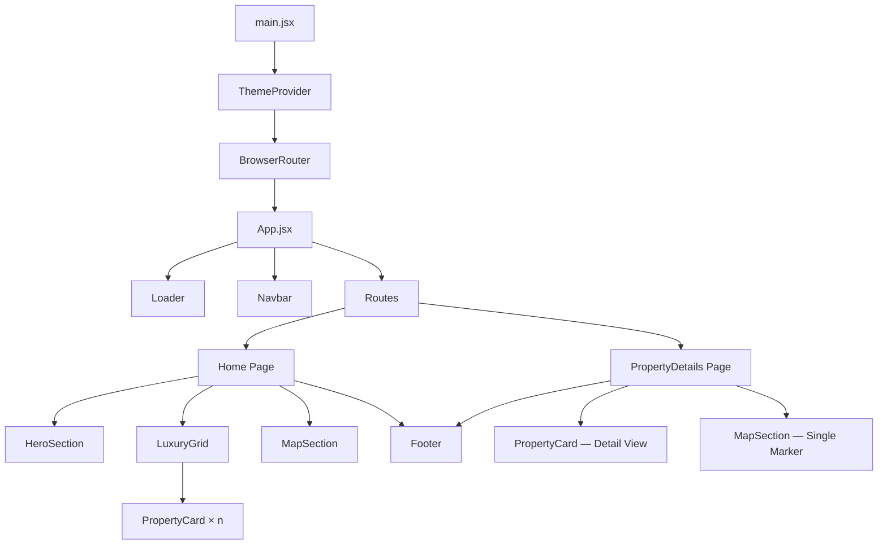
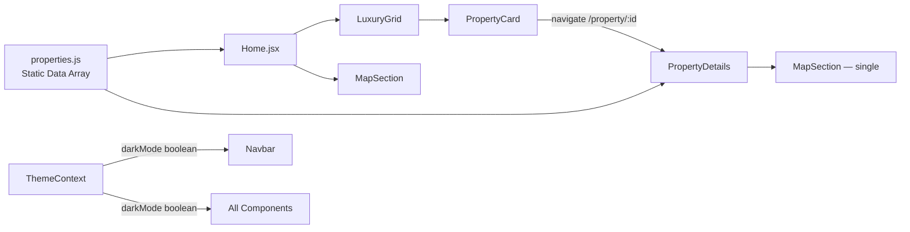
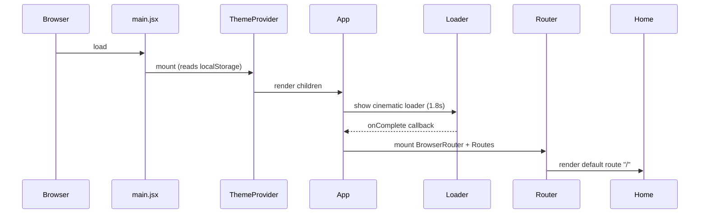
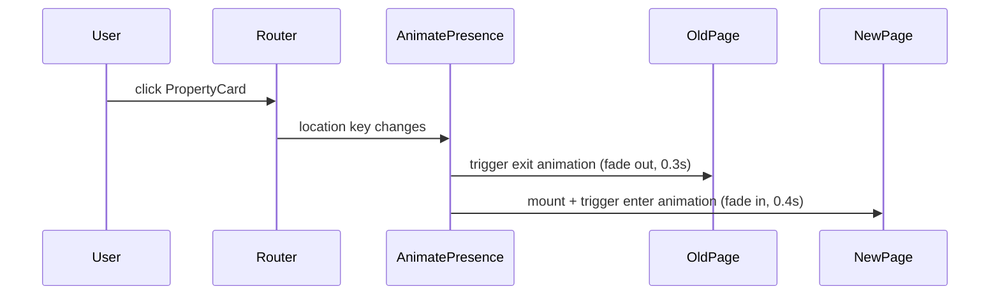
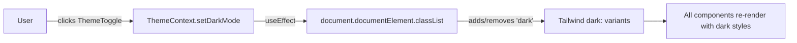

# Design Document: Luxury Real Estate Website

## Overview

A frontend-only luxury real estate showcase built with React 19, Vite, and Tailwind CSS v4. The site presents a curated collection of high-end global properties through cinematic visuals, smooth Framer Motion animations, an interactive Leaflet map, and a polished dark/light theme system. The architecture is a single-page application with client-side routing via React Router v7, where all data is sourced from a static JavaScript module (`properties.js`) — no backend or API calls are required.

The design philosophy mirrors luxury villa showcase platforms: generous whitespace, gold accents, glassmorphism surfaces, and transitions that feel deliberate and unhurried. Every component is built mobile-first and scales gracefully to ultra-wide displays.

The existing scaffold (`Navbar`, `HeroSection`, `ThemeContext`) is treated as the foundation. All new components extend the same patterns: Tailwind utility classes for layout, `useContext(ThemeContext)` for theme-aware styling, and Framer Motion variants for entrance and interaction animations.

---

## Architecture

### High-Level System Architecture



### Data Flow



### Entry Point Bootstrap Sequence



---

## Routing Structure

React Router v7 with `BrowserRouter`. All routes are defined in `App.jsx`.

| Path | Component | Description |
|---|---|---|
| `/` | `Home` | Landing page — Hero + Grid + Map + Footer |
| `/property/:id` | `PropertyDetails` | Full detail view for a single property |
| `*` | Redirect → `/` | Catch-all fallback |

### Route Transition Strategy

Wrap `<Routes>` in an `<AnimatePresence>` block. Each page component's root element uses a Framer Motion `motion.div` with a shared `pageVariants` object so entering and exiting pages cross-fade smoothly.



---

## Components and Interfaces

This section details every component's contract — props, state, and responsibilities. See the subsections below.

## Component Hierarchy & Breakdown

### Component Tree

```
App.jsx
├── Loader                        (conditional, shown on first mount)
├── Navbar                        (fixed, always visible)
└── Routes
    ├── Home (/)
    │   ├── HeroSection
    │   ├── LuxuryGrid
    │   │   └── PropertyCard × n
    │   ├── MapSection
    │   └── Footer
    └── PropertyDetails (/property/:id)
        ├── Navbar (inherited from App)
        ├── [Detail Hero — inline, not a separate component]
        ├── MapSection (single marker)
        └── Footer
```

---

### `main.jsx` — Bootstrap

**Responsibility**: Mount React root, wrap with `ThemeProvider` and `BrowserRouter`.

```jsx
// Updated main.jsx structure
<ThemeProvider>
  <BrowserRouter>
    <App />
  </BrowserRouter>
</ThemeProvider>
```

---

### `App.jsx` — Shell

**Responsibility**: Manage the `loading` state, render `Loader` until complete, then render `Navbar` + `Routes`.

**State**:
| State | Type | Default | Purpose |
|---|---|---|---|
| `loading` | `boolean` | `true` | Controls Loader visibility |

**Props**: none (root component)

**Key Logic**:
- `useEffect` sets `loading = false` after 1800ms
- `<AnimatePresence>` wraps `<Routes>` for page transitions
- Location key passed to `AnimatePresence` via `useLocation()`

---

### `Loader` — Cinematic Loading Screen

**Responsibility**: Full-screen branded loading animation shown once on initial page load.

**Props**:
| Prop | Type | Description |
|---|---|---|
| `onComplete` | `() => void` | Callback fired when exit animation finishes |

**Animation**: Framer Motion — logo text fades in, gold underline slides in from left, then entire screen fades out upward.

**Design**:
- Background: `#0a0a0a` (near-black)
- Center: "LuxeEstate" in Playfair Display, white, large
- Gold animated underline beneath the wordmark
- Duration: ~1.8s total, then calls `onComplete`

---

### `Navbar` — Fixed Glassmorphism Navigation

**Responsibility**: Site-wide navigation bar with logo, nav links, and theme toggle. Already built — needs nav links and scroll-aware opacity added.

**Existing**: Logo + dark/light toggle via `ThemeContext`.

**Additions**:
- Nav links: "Properties", "Map", "Contact" (smooth-scroll anchors on Home; router links on detail page)
- Scroll listener: increase backdrop blur / add border-bottom when `scrollY > 80`
- Replace inline toggle button with `<ThemeToggle />` component

**State** (local):
| State | Type | Default | Purpose |
|---|---|---|---|
| `scrolled` | `boolean` | `false` | Triggers enhanced glassmorphism on scroll |

**Context consumed**: `ThemeContext` → `darkMode`

---

### `ThemeToggle` — Icon Button

**Responsibility**: Encapsulates the sun/moon toggle button, extracted from `Navbar` for reuse.

**Props**: none (reads/writes `ThemeContext` directly)

**Design**: `FaSun` / `FaMoon` from react-icons, gold color on hover, smooth icon swap via Framer Motion `AnimatePresence`.

---

### `HeroSection` — Fullscreen Landing Hero

**Responsibility**: Fullscreen cinematic hero with background image, overlay, animated headline, and CTA. Already built — needs Framer Motion animations.

**Additions**:
- Staggered entrance: eyebrow text → headline → CTA button, each with `fadeInUp` variant
- Parallax scroll effect on background image via `useScroll` + `useTransform`
- CTA button scrolls to `#properties` section

**Animation Variants**:
```
container: staggerChildren 0.2s
eyebrow:   fadeInUp, delay 0s
headline:  fadeInUp, delay 0.2s
cta:       fadeInUp, delay 0.4s
```

---

### `Home` — Page Component

**Responsibility**: Assembles all homepage sections. Imports `properties` array and passes slices to child components.

**Props**: none

**Data**:
- Imports `properties` from `../data/properties.js`
- Passes full array to `<LuxuryGrid>` and `<MapSection>`

**Structure**:
```jsx
<motion.div variants={pageVariants}>
  <HeroSection />
  <LuxuryGrid properties={properties} />        {/* id="properties" */}
  <MapSection properties={properties} />         {/* id="map" */}
  <Footer />
</motion.div>
```

---

### `LuxuryGrid` — Property Card Grid

**Responsibility**: Renders the full property collection in a responsive masonry-style grid with section header and optional filter tabs.

**Props**:
| Prop | Type | Description |
|---|---|---|
| `properties` | `Property[]` | Full array from `properties.js` |

**State** (local):
| State | Type | Default | Purpose |
|---|---|---|---|
| `filter` | `'all' \| 'featured'` | `'all'` | Filters displayed cards |

**Layout**: CSS Grid — 1 col mobile, 2 col tablet, 3 col desktop, 4 col xl.

**Animation**: `motion.div` with `staggerChildren` so cards animate in sequentially as the section enters the viewport (`whileInView`).

**Section Header**: "Our Properties" in Playfair Display, gold decorative line beneath.

---

### `PropertyCard` — Individual Property Card

**Responsibility**: Displays a single property's image, title, price, location, and key stats. Links to the detail page.

**Props**:
| Prop | Type | Description |
|---|---|---|
| `property` | `Property` | Single property object |

**Design**:
- Rounded corners (`rounded-2xl`)
- Image with hover zoom (`scale-110`, `transition duration-700`)
- Glassmorphism info overlay at bottom: `bg-black/40 backdrop-blur-sm`
- Gold price text
- Beds / Baths / Sqft icons row (react-icons)
- Hover: card lifts (`translateY(-8px)`), shadow deepens

**Interaction**: Entire card is a `<Link to={/property/${property.id}}>` wrapper.

**Animation**: Framer Motion `whileHover` scale + shadow, `initial/animate` fade-in-up on mount.

---

### `MapSection` — Interactive Property Map

**Responsibility**: Renders a React Leaflet map with markers for each property. Clicking a marker shows a popup with property name, price, and a link to the detail page.

**Props**:
| Prop | Type | Description |
|---|---|---|
| `properties` | `Property[]` | Array of properties with `lat`/`lng` |
| `singleProperty` | `Property \| null` | Optional — when on detail page, centers on one property |

**Map Config**:
- Tile layer: OpenStreetMap (`https://{s}.tile.openstreetmap.org/{z}/{x}/{y}.png`)
- Default center: `[20, 0]`, zoom `2` (world view) when showing all properties
- When `singleProperty` provided: center on `[lat, lng]`, zoom `14`
- Custom gold marker icon (SVG, replaces default Leaflet blue pin)

**Popup Content**:
```
[Property Title]
[Price]
[View Details →] (Link)
```

**Theme Integration**: Map container background adapts — dark mode uses a dark tile layer filter via CSS (`filter: invert(90%) hue-rotate(180deg)` on `.leaflet-tile`).

**Note on SSR/Hydration**: React Leaflet requires `window` — safe in Vite/CSR context, no special handling needed.

---

### `PropertyDetails` — Detail Page

**Responsibility**: Full-page view for a single property. Fetches property by `id` from the static array.

**Route Param**: `id` from `/property/:id`

**Data**: `const property = properties.find(p => p.id === Number(id))`

**Sections**:
1. **Detail Hero** — fullscreen image with property title + price overlay, back button
2. **Stats Bar** — beds, baths, sqft, location in a horizontal strip
3. **Description** — full `description` text, elegant typography
4. **Image Gallery** — Swiper carousel of additional images (or single image repeated for MVP)
5. **Map** — `<MapSection singleProperty={property} />`
6. **Footer**

**Animation**: Page entrance via `pageVariants`, stats bar items stagger in, gallery slides in from right.

**Error State**: If `id` not found, render a "Property not found" message with a back-to-home link.

---

### `Footer` — Site Footer

**Responsibility**: Branding, navigation links, social icons, and contact info.

**Design**:
- Dark background (`#0a0a0a`) regardless of theme
- Three columns: Brand + tagline | Quick Links | Contact
- Social icons row: Instagram, Twitter/X, LinkedIn, Facebook (react-icons `FaInstagram`, `FaXTwitter`, etc.)
- Gold divider line above copyright
- Copyright line: "© 2025 LuxeEstate. All rights reserved."

**Props**: none

---

## Data Models

### `Property` Object Shape

```javascript
// src/data/properties.js
{
  id: Number,           // unique integer, used as route param
  title: String,        // e.g. "Villa Serenità"
  price: String,        // formatted, e.g. "$4,200,000"
  location: String,     // e.g. "Amalfi Coast, Italy"
  description: String,  // 2-3 sentence property description
  image: String,        // Unsplash URL (primary image)
  beds: Number,         // bedroom count
  baths: Number,        // bathroom count
  sqft: Number,         // square footage
  lat: Number,          // latitude for map marker
  lng: Number,          // longitude for map marker
  featured: Boolean     // true = shown in "Featured" filter
}
```

### Sample Properties Dataset (8 entries)

| # | Title | Location | Price | Featured |
|---|---|---|---|---|
| 1 | Villa Serenità | Amalfi Coast, Italy | $4,200,000 | true |
| 2 | Sky Penthouse | Manhattan, New York | $8,500,000 | true |
| 3 | Château Lumière | Provence, France | $6,750,000 | false |
| 4 | Palm Oasis Estate | Dubai, UAE | $5,100,000 | true |
| 5 | Malibu Cliffside | Malibu, California | $7,300,000 | false |
| 6 | Santorini Retreat | Santorini, Greece | $3,800,000 | true |
| 7 | Tokyo Sky Residence | Tokyo, Japan | $4,950,000 | false |
| 8 | Cape Winelands Manor | Cape Town, South Africa | $2,900,000 | false |

All images sourced from Unsplash (luxury villa / penthouse search queries). Coordinates are real geographic coordinates for each location.

---

## Theme System Design

### Architecture

The existing `ThemeContext` uses a `darkMode` boolean toggled by `setDarkMode`. Tailwind v4's `@custom-variant dark` directive (already in `index.css`) applies dark styles when the `dark` class is on `<html>`.



### Enhancement: localStorage Persistence

Add `localStorage` read on init and write on change to `ThemeContext`:

```javascript
// On mount: read saved preference
const [darkMode, setDarkMode] = useState(
  () => localStorage.getItem('theme') === 'dark'
);

// On change: persist
useEffect(() => {
  localStorage.setItem('theme', darkMode ? 'dark' : 'light');
  document.documentElement.classList.toggle('dark', darkMode);
}, [darkMode]);
```

### Color Tokens

| Token | Light Mode | Dark Mode | Usage |
|---|---|---|---|
| Background | `#FFFFFF` / `#F5F0E8` (cream) | `#0a0a0a` | Page background |
| Surface | `#F5F0E8` | `#1a1a1a` | Card backgrounds |
| Text Primary | `#1a1a1a` | `#FFFFFF` | Headings |
| Text Secondary | `#6B6B6B` | `#A0A0A0` | Body, captions |
| Gold Accent | `#C9A84C` | `#C9A84C` | Prices, borders, highlights |
| Gold Hover | `#E8C96A` | `#E8C96A` | Hover states |
| Glassmorphism | `rgba(255,255,255,0.15)` | `rgba(0,0,0,0.4)` | Navbar, card overlays |

### Transition Strategy

All theme-sensitive elements use `transition-colors duration-500` (already on `App.jsx`'s root div). This ensures no jarring flash when toggling.

---

## Animation Strategy

### Library: Framer Motion v12

All animations use Framer Motion's declarative API. Shared variant objects are defined once and reused across components.

### Shared Variant Definitions

```javascript
// Reusable across components
export const fadeInUp = {
  hidden: { opacity: 0, y: 40 },
  visible: { opacity: 1, y: 0, transition: { duration: 0.6, ease: 'easeOut' } }
};

export const fadeIn = {
  hidden: { opacity: 0 },
  visible: { opacity: 1, transition: { duration: 0.5 } }
};

export const staggerContainer = {
  hidden: {},
  visible: { transition: { staggerChildren: 0.15 } }
};

export const pageVariants = {
  initial: { opacity: 0, y: 20 },
  animate: { opacity: 1, y: 0, transition: { duration: 0.4, ease: 'easeOut' } },
  exit:    { opacity: 0, y: -20, transition: { duration: 0.3 } }
};
```

### Animation Inventory by Component

| Component | Animation Type | Trigger | Details |
|---|---|---|---|
| `Loader` | Fade in → fade out | Mount / unmount | Logo text + gold line, then full screen exit |
| `HeroSection` | Staggered fade-in-up | Mount | Eyebrow → headline → CTA, 0.2s stagger |
| `HeroSection` | Parallax scroll | `useScroll` | Background image moves at 0.4× scroll speed |
| `Navbar` | Glassmorphism intensify | Scroll > 80px | `backdrop-blur` increases, border appears |
| `ThemeToggle` | Icon swap | Click | `AnimatePresence` cross-fade sun ↔ moon |
| `LuxuryGrid` | Staggered card entrance | `whileInView` | Cards fade-in-up sequentially, `once: true` |
| `PropertyCard` | Hover lift + zoom | `whileHover` | `y: -8`, image `scale: 1.1`, shadow deepens |
| `PropertyCard` | Image zoom | CSS transition | `group-hover:scale-110 duration-700` |
| `MapSection` | Fade in | `whileInView` | Section fades in as user scrolls to it |
| `PropertyDetails` | Page transition | Route change | `pageVariants` via `AnimatePresence` |
| `PropertyDetails` | Stats stagger | Mount | Each stat item fades in with 0.1s stagger |
| `Footer` | Fade in | `whileInView` | Columns fade in with stagger |

### `whileInView` Pattern

All below-fold sections use `whileInView` with `viewport={{ once: true, amount: 0.2 }}` so animations fire once when 20% of the section is visible. This avoids re-triggering on scroll-back.

---

## Responsive Design

### Breakpoints (Tailwind v4 defaults)

| Breakpoint | Min Width | Target Devices |
|---|---|---|
| `sm` | 640px | Large phones (landscape) |
| `md` | 768px | Tablets |
| `lg` | 1024px | Laptops |
| `xl` | 1280px | Desktops |
| `2xl` | 1536px | Large / ultra-wide |

### Grid Behavior

**LuxuryGrid**:
```
mobile (default): grid-cols-1
sm:               grid-cols-1
md:               grid-cols-2
lg:               grid-cols-3
xl:               grid-cols-4
```

**PropertyDetails Stats Bar**:
```
mobile: flex-col, stacked
md:     flex-row, horizontal strip
```

**Navbar**:
```
mobile: logo + toggle only (hamburger menu hidden for MVP)
md+:    logo + nav links + toggle
```

**Footer**:
```
mobile: single column, stacked
md:     two columns
lg:     three columns
```

### Typography Scale

| Element | Mobile | Desktop | Font |
|---|---|---|---|
| Hero Headline | `text-4xl` | `text-7xl` | Playfair Display, `font-light` |
| Section Title | `text-3xl` | `text-5xl` | Playfair Display |
| Card Title | `text-lg` | `text-xl` | Playfair Display |
| Body Text | `text-sm` | `text-base` | Poppins |
| Price | `text-base` | `text-lg` | Poppins, `font-semibold`, gold |
| Caption / Label | `text-xs` | `text-sm` | Poppins, uppercase, tracking-wide |

---

## Typography System

### Font Loading

Add to `index.html` `<head>`:
```html
<link rel="preconnect" href="https://fonts.googleapis.com">
<link rel="preconnect" href="https://fonts.gstatic.com" crossorigin>
<link href="https://fonts.googleapis.com/css2?family=Playfair+Display:wght@300;400;500;700&family=Poppins:wght@300;400;500;600&display=swap" rel="stylesheet">
```

### Tailwind Font Family Config

In `index.css` (Tailwind v4 uses CSS-based config):
```css
@theme {
  --font-playfair: 'Playfair Display', Georgia, serif;
  --font-poppins: 'Poppins', system-ui, sans-serif;
}
```

Usage: `font-playfair` for headings, `font-poppins` for body (set as default on `body`).

---

## Color Palette

### Primary Palette

| Name | Hex | Tailwind Custom Token | Usage |
|---|---|---|---|
| Gold | `#C9A84C` | `--color-gold` | Accents, prices, borders, CTA hover |
| Gold Light | `#E8C96A` | `--color-gold-light` | Hover states |
| Cream | `#F5F0E8` | `--color-cream` | Light mode background variant |
| Charcoal | `#1a1a1a` | `--color-charcoal` | Dark mode surface |
| Near Black | `#0a0a0a` | `--color-near-black` | Dark mode background, footer |
| Off White | `#F8F8F8` | — | Light mode card surface |

### Tailwind v4 Custom Tokens (in `index.css`)

```css
@theme {
  --color-gold: #C9A84C;
  --color-gold-light: #E8C96A;
  --color-cream: #F5F0E8;
  --color-charcoal: #1a1a1a;
  --color-near-black: #0a0a0a;
}
```

Usage example: `text-gold`, `border-gold`, `bg-near-black`.

---

## Map Integration Design

### Library Stack

- `react-leaflet` v5 + `leaflet` v1.9
- Tile provider: OpenStreetMap (free, no API key)

### Component Structure

```jsx
<MapContainer center={center} zoom={zoom} className="h-[500px] w-full rounded-2xl">
  <TileLayer url="https://{s}.tile.openstreetmap.org/{z}/{x}/{y}.png" />
  {properties.map(p => (
    <Marker key={p.id} position={[p.lat, p.lng]} icon={goldIcon}>
      <Popup>
        <strong>{p.title}</strong>
        <p>{p.price}</p>
        <Link to={`/property/${p.id}`}>View Details →</Link>
      </Popup>
    </Marker>
  ))}
</MapContainer>
```

### Custom Gold Marker Icon

Replace Leaflet's default blue pin with a custom SVG marker using gold fill:

```javascript
import L from 'leaflet';

const goldIcon = L.divIcon({
  className: '',
  html: `<svg width="24" height="36" viewBox="0 0 24 36" fill="none">
    <path d="M12 0C5.37 0 0 5.37 0 12c0 9 12 24 12 24s12-15 12-24C24 5.37 18.63 0 12 0z" fill="#C9A84C"/>
    <circle cx="12" cy="12" r="5" fill="white"/>
  </svg>`,
  iconSize: [24, 36],
  iconAnchor: [12, 36],
  popupAnchor: [0, -36]
});
```

### Dark Mode Map Tiles

Apply a CSS filter to invert tile colors in dark mode:

```css
/* index.css */
.dark .leaflet-tile {
  filter: invert(90%) hue-rotate(180deg) brightness(95%) contrast(90%);
}
```

### Leaflet CSS Import

Must be imported in `main.jsx` or `index.css`:
```javascript
import 'leaflet/dist/leaflet.css';
```

---

## Glassmorphism Design System

Glassmorphism is used consistently across three surfaces:

| Surface | Classes | Context |
|---|---|---|
| Navbar | `bg-black/20 backdrop-blur-md border-b border-white/10` | Always visible; blur increases on scroll |
| PropertyCard overlay | `bg-black/40 backdrop-blur-sm` | Info strip at card bottom |
| Map Popup | Custom CSS: `bg-white/90 backdrop-blur-sm` | Leaflet popup override |
| Loader | `bg-[#0a0a0a]` | Solid, not glass — cinematic feel |

---

## Error Handling

| Scenario | Handling |
|---|---|
| Invalid property `id` in URL | Show "Property not found" with back-to-home `<Link>` |
| Unsplash image fails to load | `onError` sets fallback to a local placeholder or solid gold gradient |
| Map renders outside viewport | `MapContainer` uses fixed pixel height, not `h-full` |
| Leaflet CSS not loaded | Import in `main.jsx` before component tree mounts |
| `properties.js` empty array | `LuxuryGrid` renders "No properties available" message |

---

## Correctness Properties

*A property is a characteristic or behavior that should hold true across all valid executions of a system — essentially, a formal statement about what the system should do. Properties serve as the bridge between human-readable specifications and machine-verifiable correctness guarantees.*

These are the invariants and behavioral guarantees the implementation must uphold.

### Property 1: Theme persistence

For all user sessions, if `localStorage.getItem('theme') === 'dark'` then `document.documentElement.classList.contains('dark') === true` on page load, and vice versa. The theme state is never lost between page refreshes.

**Validates: Requirements 4.1, 4.2, 4.3, 4.5**

### Property 2: Route resolution completeness

For every `id` in `properties.js`, navigating to `/property/:id` renders the `PropertyDetails` page with data matching that `id`. For any `id` not in the array, the page renders a "not found" state — never a blank screen or runtime error.

**Validates: Requirements 8.1, 8.2, 12.3**

### Property 3: PropertyCard renders for any valid property

For every `Property` object `p` in the array, `<PropertyCard property={p} />` renders without throwing, regardless of which optional fields are present. Required fields (`id`, `title`, `price`, `location`, `image`) are always sufficient for a complete render.

**Validates: Requirements 6.1, 6.8**

### Property 4: Map marker coverage

For every property with valid `lat` and `lng` values, a `<Marker>` is rendered on the map. No markers are rendered for properties with missing or `null` coordinates.

**Validates: Requirements 7.2, 13.4**

### Property 5: Grid filter correctness

When `filter === 'featured'`, `LuxuryGrid` renders exactly the subset of properties where `property.featured === true`. When `filter === 'all'`, all properties are rendered. The rendered count never exceeds the total array length.

**Validates: Requirements 5.1, 5.5, 5.6**

### Property 6: Animation fires once per page load

All `whileInView` animations use `viewport={{ once: true }}`, ensuring each section's entrance animation fires exactly once per page load, not on every scroll pass.

**Validates: Requirements 9.5**

### Property 7: Dark map tiles follow theme

When `darkMode === true`, the CSS class `dark` is present on `<html>`, and the Leaflet tile filter rule `filter: invert(90%) hue-rotate(180deg)` is applied to `.leaflet-tile` elements. When `darkMode === false`, no filter is applied.

**Validates: Requirements 4.2, 4.3, 7.7, 7.8**

### Property 8: Loader gates all content

The `Loader` component is rendered and visible until `loading === false`. No page content (Hero, Grid, Map) is visible to the user while `loading === true`. The `onComplete` callback is called exactly once.

**Validates: Requirements 1.1, 1.2, 1.5, 1.6**

## Testing Strategy

### Unit Testing Approach

Test individual components in isolation using React Testing Library. Key unit test targets:

- `ThemeContext`: toggling `darkMode` adds/removes `dark` class on `<html>`; `localStorage` is read on init and written on change.
- `PropertyCard`: renders title, price, location, and stats correctly for a given property object; `<Link>` points to `/property/:id`.
- `LuxuryGrid`: with `filter='featured'` renders only featured properties; with `filter='all'` renders all.
- `PropertyDetails`: with a valid `id` renders property data; with an invalid `id` renders the not-found message.
- `Loader`: calls `onComplete` after the animation duration.

### Property-Based Testing Approach

**Property Test Library**: fast-check

- **PropertyCard rendering**: For any randomly generated `Property` object with valid required fields (`id`, `title`, `price`, `location`, `image`), `<PropertyCard>` renders without throwing.
- **Filter invariant**: For any array of `Property` objects, filtering by `featured === true` and rendering in `LuxuryGrid` produces a count ≤ total array length, and every rendered card has `featured === true`.
- **Route param round-trip**: For any `id` in the properties array, `parseInt(useParams().id)` equals the original `id` integer.

### Integration Testing Approach

- **Navigation flow**: Clicking a `PropertyCard` navigates to `/property/:id` and the `PropertyDetails` page renders the correct property title.
- **Theme toggle persistence**: Toggling dark mode, refreshing the page, and checking that the same mode is restored from `localStorage`.
- **Map + data sync**: The number of `<Marker>` elements in the DOM equals the number of properties with valid coordinates.


| Library | Version | Purpose |
|---|---|---|
| `react` | ^19.2 | UI framework |
| `react-dom` | ^19.2 | DOM rendering |
| `react-router-dom` | ^7.15 | Client-side routing |
| `framer-motion` | ^12.38 | Animations and transitions |
| `react-leaflet` | ^5.0 | Map component wrapper |
| `leaflet` | ^1.9 | Map engine |
| `react-icons` | ^5.6 | Icon library (Fa, Md sets) |
| `swiper` | ^12.1 | Image carousel on detail page |
| `react-player` | ^3.4 | Optional video background (future) |
| `tailwindcss` | ^4.3 | Utility-first CSS |
| `@tailwindcss/vite` | ^4.3 | Vite plugin for Tailwind v4 |

---

## Implementation Notes

1. **`BrowserRouter` placement**: Move from `App.jsx` to `main.jsx` so `useLocation()` is accessible inside `App` for `AnimatePresence` key.
2. **Leaflet default icon fix**: Leaflet v1.9 has a known Webpack/Vite asset resolution issue with default marker icons. Use the custom `goldIcon` (defined above) to bypass this entirely.
3. **Tailwind v4 dark variant**: Already configured via `@custom-variant dark (&:where(.dark, .dark *))` in `index.css`. All dark styles use `dark:` prefix as normal.
4. **Font loading**: Google Fonts via `<link>` in `index.html` is the simplest approach for Vite — no npm package needed.
5. **Swiper CSS**: Import `swiper/css` and `swiper/css/navigation` in the component that uses it, not globally.
6. **`react-player` usage**: Reserved for a potential video background feature. Not required for MVP but the dependency is already installed.
